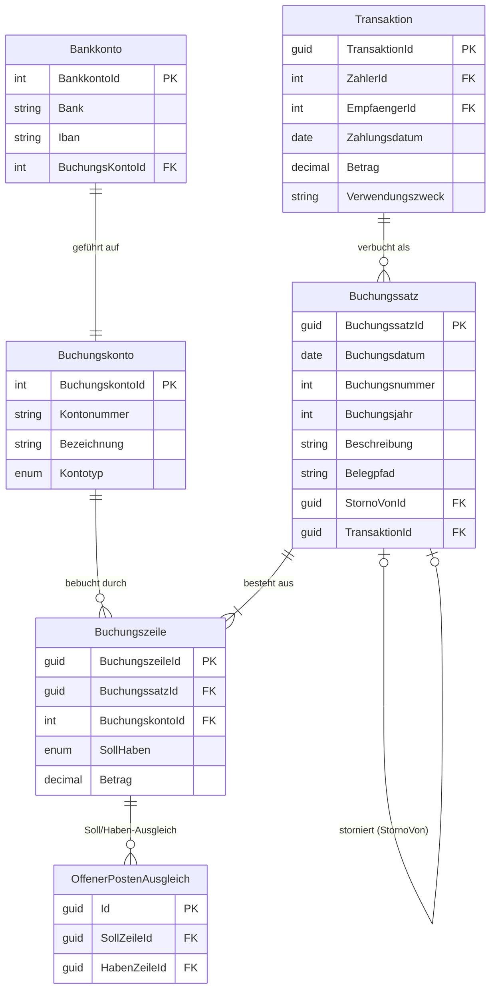
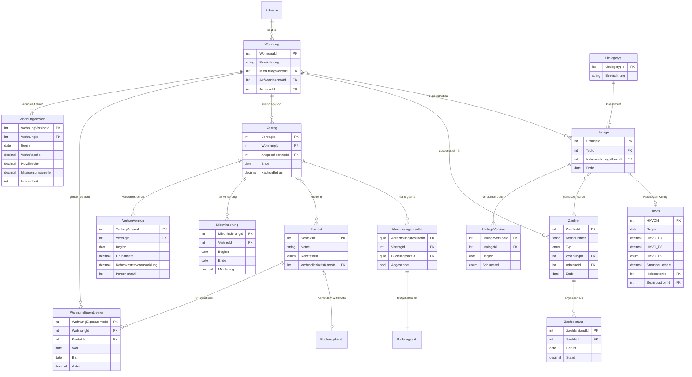

# Datenmodell

Walter verwendet PostgreSQL als Datenbank und Entity Framework Core als ORM. Alle Entitäten befinden sich im Projekt `Deeplex.Saverwalter.Model` (Ordner `model/`, Authentifizierung in `Auth/`).

Zwei Dinge prägen das Modell:

1. **Versionierung statt Überschreiben.** Veränderliche Stammdaten (Wohnungsflächen, Miethöhe, Umlageschlüssel, Eigentümer) werden als zeitlich gültige *Versionen* bzw. Zuordnungen mit `Beginn`/`Ende` geführt, nicht direkt auf der Hauptentität.
2. **Doppelte Buchführung.** Geldbeträge werden als **Buchungssätze** mit Soll-/Haben-**Buchungszeilen** auf **Buchungskonten** geführt. Eine Miete, eine Betriebskostenrechnung, ein Erhaltungsaufwand — jeder Betrag ist eine Buchung. Fachentitäten (Wohnung, Vertrag, Umlage, Kontakt) verweisen auf „ihre“ Konten.

---

## Entity-Relationship-Diagramm (Kern)

> **HKVO:** Eine `HKVO` referenziert eine `Heizkosten`-Umlage und eine `Betriebsstrom`-Umlage (beide Pflicht). Eine Umlage kann über `HeizkostenHKVOs` bzw. `BetriebsstromHKVOs` in beiden Rollen auftreten.

---

## Buchführungs-Entitäten

### Buchungskonto

Ein Konto im Kontenrahmen. Fachentitäten besitzen ihre Konten (z. B. `Wohnung.AufwandsKonto`).

| Feld             | Typ              | Pflicht | Beschreibung                          |
|------------------|------------------|---------|---------------------------------------|
| `BuchungskontoId`| int              | PK      | Primärschlüssel                       |
| `Kontonummer`    | string           | ja      | Kontonummer im Kontenrahmen           |
| `Bezeichnung`    | string           | ja      | Klartextbezeichnung                   |
| `Kontotyp`       | BuchungskontoTyp | ja      | `Aktiv`, `Passiv`, `Aufwand`, `Ertrag`|
| `Notiz`          | string           | nein    |                                       |

### Buchungssatz

Ein vollständiger Buchungssatz. Ob er bearbeitet, gelöscht oder nur storniert werden kann, regelt `BuchungssatzSchutz`: ein **freier** Satz (nicht in eine Betriebskostenabrechnung eingeflossen, ohne Offene-Posten-Ausgleich, kein Storno/nicht storniert) ist löschbar/bearbeitbar; mit OPOS-Verknüpfung ist stattdessen ein **Storno** nötig; abrechnungsrelevante Sätze sind gesperrt (nur über die Rückabwicklung/Storno des Abrechnungslaufs).

> Ein noch nicht „verwendeter" Satz darf frei korrigiert oder gelöscht werden. Sobald er
> ausgeglichen (OPOS) oder in eine Abrechnung eingeflossen ist, bleibt er erhalten und wird
> nur per Storno korrigiert — so bleiben bereits verwendete Buchungen nachvollziehbar.

| Feld            | Typ          | Pflicht | Beschreibung                                                |
|-----------------|--------------|---------|------------------------------------------------------------|
| `BuchungssatzId`| Guid         | PK      | Primärschlüssel                                            |
| `Buchungsdatum` | DateOnly     | ja      | Datum der Buchung                                          |
| `Beschreibung`  | string       | ja      | Buchungstext                                              |
| `Buchungsnummer`| int          | (auto)  | Fortlaufende Nummer aus einer globalen DB-Sequence (`buchungsnummer_seq`), beim Speichern vergeben; Index über `(Buchungsjahr, Buchungsnummer)` |
| `Buchungsjahr`  | int          | ja      | Wirtschaftsjahr (Default = Jahr des Buchungsdatums)        |
| `Belegpfad`     | string       | nein    | S3-Pfad zum Originalbeleg                                  |
| `StornoVon`     | Buchungssatz | nein    | Gesetzt, wenn dieser Satz ein Storno ist                  |
| `StornoNach`    | Buchungssatz | nein    | Rücknavigation: gesetzt, wenn dieser Satz storniert wurde |
| `Transaktion`   | Transaktion  | nein    | Verweis auf den importierten Kontoauszugseintrag          |
| `Notiz`         | string       | nein    |                                                            |

### Buchungszeile

Eine Soll- oder Haben-Zeile eines Buchungssatzes.

| Feld            | Typ          | Pflicht | Beschreibung                            |
|-----------------|--------------|---------|-----------------------------------------|
| `BuchungszeileId`| Guid        | PK      | Primärschlüssel                         |
| `Buchungssatz`  | Buchungssatz | ja      | Zugehöriger Satz                        |
| `Buchungskonto` | Buchungskonto| ja      | Bebuchtes Konto                         |
| `SollHaben`     | SollHaben    | ja      | `Soll` oder `Haben`                     |
| `Betrag`        | decimal      | ja      | Betrag in Euro                          |

### OffenerPostenAusgleich

Verbindet eine offene Forderung (Soll-Zeile) mit ihrer ausgleichenden Zahlung (Haben-Zeile) auf demselben Buchungskonto (OPOS-Prinzip).

| Feld          | Typ           | Pflicht | Beschreibung                       |
|---------------|---------------|---------|------------------------------------|
| `…Id`         | Guid          | PK      | Primärschlüssel                    |
| `SollZeile`   | Buchungszeile | ja      | Die offene Forderung               |
| `HabenZeile`  | Buchungszeile | ja      | Die ausgleichende Zahlung          |

*Invariante:* `SollZeile.BuchungskontoId == HabenZeile.BuchungskontoId`. Offen ist eine Forderung, solange Σ(Ausgleiche) < `SollZeile.Betrag`.

### Transaktion

Ein importierter oder manuell erfasster Kontoauszugseintrag.

| Feld               | Typ        | Pflicht | Beschreibung                       |
|--------------------|------------|---------|------------------------------------|
| `TransaktionId`    | Guid       | PK      | Primärschlüssel                    |
| `Zahler`           | Bankkonto  | nein    | Zahlendes Bankkonto                |
| `Zahlungsempfaenger`| Bankkonto | nein    | Empfangendes Bankkonto             |
| `Zahlungsdatum`    | DateOnly   | ja      | Datum der Zahlung                  |
| `Betrag`           | decimal    | ja      | Betrag in Euro                     |
| `Verwendungszweck` | string     | ja      | Verwendungszweck                   |
| `Buchungssaetze`   | List       | —       | Zugeordnete Buchungssätze          |

### Bankkonto

| Feld            | Typ           | Pflicht | Beschreibung                       |
|-----------------|---------------|---------|------------------------------------|
| `BankkontoId`   | int           | PK      | Primärschlüssel                    |
| `Bank`          | string        | nein    | Name der Bank                      |
| `Iban`          | string        | nein    | IBAN                               |
| `Besitzer`      | List\<Kontakt\>| —      | Kontoinhaber                       |
| `BuchungsKonto` | Buchungskonto | ja      | Zugehöriges Buchungskonto          |

> Bei der Erfassung ist mindestens **IBAN oder Bank** erforderlich.

---

## Stamm- und Fachentitäten

### Adresse

| Feld           | Typ    | Pflicht | Beschreibung |
|----------------|--------|---------|--------------|
| `AdresseId`    | int    | PK      | Primärschlüssel |
| `Strasse`      | string | ja      | Straßenname |
| `Hausnummer`   | string | ja      | Hausnummer |
| `Postleitzahl` | string | ja      | Postleitzahl |
| `Stadt`        | string | ja      | Stadt |
| `Notiz`        | string | nein    | |

Berechnetes Feld: `Anschrift` → `"Strasse Hausnummer, PLZ Stadt"`.

### Kontakt

Natürliche oder juristische Person (Vermieter, Mieter, Ansprechpartner, Handwerker …).

| Feld                   | Typ           | Pflicht | Beschreibung |
|------------------------|---------------|---------|--------------|
| `KontaktId`            | int           | PK      | Primärschlüssel |
| `Name`                 | string        | ja      | Nachname oder Firmenname |
| `Rechtsform`           | Rechtsform    | ja      | siehe unten |
| `Vorname`              | string        | nein    | nur natürliche Personen |
| `Anrede`               | Anrede        | nein    | `Herr`, `Frau`, `Keine` |
| `Telefon`/`Mobil`/`Fax`/`Email` | string | nein  | Kontaktdaten |
| `Adresse`              | Adresse       | nein    | Postanschrift |
| `VerbindlichkeitsKonto`| Buchungskonto | nein    | Konto für Verbindlichkeiten ggü. diesem Kontakt (z. B. Handwerker); wird bei Bedarf automatisch angelegt |
| `Notiz`                | string        | nein    | |

Berechnetes Feld: `Bezeichnung` → `"Vorname Name"` bzw. `"Name"`.

Beziehungen: `Mietvertraege`, `VerwaltetVertraege`, `EigentuemerIn` (WohnungEigentuemer), `Garagen`, `Accounts`, `AlsMitglied`/`AlsJuristischePerson` (KontaktMitgliedschaft).

**Rechtsformen:** `natuerlich`, `gmbh`, `gbr`, `ag`, `ev`, `kg`, `ohg`, `ug`, `stiftung`, `verein`, `genossenschaft`, `sonstige`.

### KontaktMitgliedschaft

Verknüpft einen Kontakt (`Mitglied`) mit einer juristischen Person (`JuristischePerson`) — z. B. Gesellschafter ↔ GmbH.

### Wohnung

Die Wohneinheit. Veränderliche Größen liegen in `WohnungVersion`, die Eigentümer in `WohnungEigentuemer`.

| Feld               | Typ           | Pflicht | Beschreibung |
|--------------------|---------------|---------|--------------|
| `WohnungId`        | int           | PK      | Primärschlüssel |
| `Bezeichnung`      | string        | ja      | z. B. „OG links“ |
| `MietErtragskonto` | Buchungskonto | ja      | Ertragskonto für Mieten dieser Wohnung |
| `AufwandsKonto`    | Buchungskonto | ja      | Aufwandskonto (Erhaltungsaufwendungen, Leerstand …) |
| `Adresse`          | Adresse       | nein    | Lage der Wohnung |
| `Notiz`            | string        | nein    | |

Beziehungen: `Versionen`, `Eigentuemer`, `Vertraege`, `Zaehler`, `Umlagen`, `Verwalter`.

### WohnungVersion

Zeitlich gültige Flächen-/Anteilsangaben einer Wohnung.

| Feld                  | Typ      | Pflicht | Beschreibung |
|-----------------------|----------|---------|--------------|
| `WohnungVersionId`    | int      | PK      | Primärschlüssel |
| `Wohnung`             | Wohnung  | ja      | Zugehörige Wohnung |
| `Beginn`              | DateOnly | ja      | Gültig ab |
| `Wohnflaeche`         | decimal  | ja      | Wohnfläche in m² |
| `Nutzflaeche`         | decimal  | ja      | Nutzfläche in m² |
| `Miteigentumsanteile` | decimal  | ja      | MEA-Anteil (WEG) |
| `Nutzeinheit`         | int      | ja      | Anzahl Nutzeinheiten |

### WohnungEigentuemer

Zeitlich begrenzte Eigentümer-Zuordnung (Wohnung ↔ Kontakt) mit `Von`/`Bis` und optionalem `Anteil`.

### Vertrag

Ein Mietverhältnis für eine Wohnung. Hält mehrere fachliche Buchungskonten.

| Feld                 | Typ           | Pflicht | Beschreibung |
|----------------------|---------------|---------|--------------|
| `VertragId`          | int           | PK      | Primärschlüssel |
| `Wohnung`            | Wohnung       | ja      | Zugehörige Wohnung |
| `Ansprechpartner`    | Kontakt       | nein    | Ansprechpartner |
| `Ende`               | DateOnly      | nein    | Vertragsende (null = laufend) |
| `MietBuchungskonto`  | Buchungskonto | ja      | Forderungskonto Kaltmiete |
| `NkBuchungskonto`    | Buchungskonto | ja      | Verrechnungskonto der NK-Vorauszahlungen (Passiv) |
| `BkAbrechnungsKonto` | Buchungskonto | ja      | Konto für das Abrechnungsergebnis |
| `ZahlungsKonto`      | Buchungskonto | ja      | Zahlungseingangskonto |
| `MietminderungsKonto`| Buchungskonto | ja      | Konto für Mietminderungen |
| `KautionBetrag`      | decimal       | nein    | Kautionshöhe |
| `KautionEingangsdatum` / `KautionRueckgabedatum` | DateOnly | nein | Kautionsdaten |
| `KautionArt`         | string        | nein    | Art der Kaution |
| `Notiz`              | string        | nein    | |

Beziehungen: `Versionen`, `Mietminderungen`, `GarageVertraege`, `Mieter` (List\<Kontakt\>), `Abrechnungsresultate`.

### VertragVersion

| Feld              | Typ      | Pflicht | Beschreibung |
|-------------------|----------|---------|--------------|
| `VertragVersionId`| int      | PK      | Primärschlüssel |
| `Vertrag`         | Vertrag  | ja      | Zugehöriger Vertrag |
| `Beginn`          | DateOnly | ja      | Gültig ab |
| `Grundmiete`      | decimal  | ja      | Kaltmiete in Euro |
| `Nebenkostenvorauszahlung` | decimal | nein | Vereinbarte monatliche NK-Vorauszahlung laut Mietvertrag (Planwert; Vorgabewert im Buchungsdialog) |
| `Personenzahl`    | int      | ja      | Personen im Haushalt |

### Mietminderung

| Feld              | Typ      | Pflicht | Beschreibung |
|-------------------|----------|---------|--------------|
| `MietminderungId` | int      | PK      | Primärschlüssel |
| `Vertrag`         | Vertrag  | ja      | Zugehöriger Vertrag |
| `Beginn`          | DateOnly | ja      | Beginn der Minderung |
| `Ende`            | DateOnly | nein    | Ende (null = unbegrenzt) |
| `Minderung`       | decimal  | ja      | Quote als Dezimalzahl (0.1 = 10 %) |

### Umlagetyp

Art einer Betriebskostenposition (z. B. „Heizkosten“, „Wasser“). Felder: `UmlagetypId`, `Bezeichnung`, `BetrKVNummer` (optional; kanonische Kategorie nach § 2 BetrKV, Nr. 1–14), `Notiz`.

### Umlage

Verbindet einen Umlagetyp mit einer Gruppe von Wohnungen. Der Verteilungsschlüssel liegt zeitlich in `UmlageVersion`.

| Feld                  | Typ           | Pflicht | Beschreibung |
|-----------------------|---------------|---------|--------------|
| `UmlageId`            | int           | PK      | Primärschlüssel |
| `Typ`                 | Umlagetyp     | ja      | Art der Kosten |
| `NkVerrechnungsKonto` | Buchungskonto | ja      | Verrechnungskonto der Nebenkosten |
| `ZahlungsKonto`       | Buchungskonto | ja      | Zahlungskonto |
| `Ende`                | DateOnly      | nein    | Enddatum der Umlage |
| `Beschreibung`/`Notiz`| string        | nein    | |

Beziehungen: `Versionen` (UmlageVersion), `Wohnungen` (n:m), `Zaehler`, `HeizkostenHKVOs`, `BetriebsstromHKVOs`.

### UmlageVersion

| Feld             | Typ              | Pflicht | Beschreibung |
|------------------|------------------|---------|--------------|
| `UmlageVersionId`| int              | PK      | Primärschlüssel |
| `Umlage`         | Umlage           | ja      | Zugehörige Umlage |
| `Beginn`         | DateOnly         | ja      | Gültig ab |
| `Schluessel`     | Umlageschluessel | ja      | Verteilungsschlüssel |

**Umlageschlüssel:** `NachWohnflaeche` (n. WF), `NachNutzflaeche` (n. NF), `NachNutzeinheit` (n. NE), `NachPersonenzahl` (n. Pers.), `NachVerbrauch` (n. Verb.), `NachMiteigentumsanteil` (n. MEA).

### HKVO

Konfiguration nach Heizkostenverordnung für eine warme Umlage.

Eine `HKVO` ist zeitlich gültig (`Beginn`); zur Abrechnung wird die zum Stichtag gültige
Konfiguration verwendet.

| Feld            | Typ        | Pflicht | Beschreibung |
|-----------------|------------|---------|--------------|
| `HKVOId`        | int        | PK      | Primärschlüssel |
| `Beginn`        | DateOnly   | ja      | Gültig ab |
| `HKVO_P7`       | decimal    | ja      | Verbrauchsanteil Heizwärme (§ 7) |
| `HKVO_P8`       | decimal    | ja      | Verbrauchsanteil Warmwasser (§ 8) |
| `HKVO_P9`       | HKVO_P9A2  | ja      | Berechnungssatz § 9 Abs. 2 (`Satz_1`, `Satz_2`, `Satz_4`) |
| `Strompauschale`| decimal    | ja      | Anteil Betriebsstrom an den Heizkosten (0 = keine Umlage) |
| `Heizkosten`    | Umlage     | ja      | Heizkosten-Umlage |
| `Betriebsstrom` | Umlage     | ja      | Betriebsstrom-/Allgemeinstrom-Umlage |
| `AllgemeinWaermeZaehler` | List\<Zaehler\> | nein | Haus-Wärmezähler (Gas/Wärme) für Q in § 9(2); leer → § 9(2) = 0 |

### Zaehler

| Feld         | Typ        | Pflicht | Beschreibung |
|--------------|------------|---------|--------------|
| `ZaehlerId`  | int        | PK      | Primärschlüssel |
| `Kennnummer` | string     | ja      | Zählernummer |
| `Typ`        | Zaehlertyp | ja      | `Warmwasser`, `Kaltwasser` (m³), `Strom`, `Gas`, `Wärme` (kWh) |
| `Wohnung`    | Wohnung    | nein    | null = Allgemeinzähler |
| `Adresse`    | Adresse    | nein    | Standort |
| `Ende`       | DateOnly   | nein    | Außerbetriebnahme |

Beziehungen: `Staende` (Zaehlerstand), `Umlagen`.

### Zaehlerstand

`ZaehlerstandId`, `Zaehler`, `Datum` (DateOnly), `Stand` (decimal), `Notiz`.

### Garage / GarageVertrag / GarageVertragVersion

- **Garage**: `GarageId`, `Kennung`, `Besitzer` (Kontakt), `Adresse`, `Ertragskonto` (Buchungskonto), `Vertraege`.
- **GarageVertrag**: `GarageVertragId`, `Garage`, optionaler Verweis auf einen `Vertrag`, `Ende`, `MietBuchungskonto`, `ZahlungsKonto`, `Mieter` (List\<Kontakt\>), `Versionen`.
- **GarageVertragVersion**: `Beginn` (DateOnly), `GaragenMiete` (decimal) — zeitlich gültige Miete des Stellplatzes.

### Abrechnungsresultat

Das gespeicherte Ergebnis einer Betriebskostenabrechnung. Die Beträge ergeben sich aus dem verknüpften `Buchungssatz`.

| Feld                    | Typ          | Pflicht | Beschreibung |
|-------------------------|--------------|---------|--------------|
| `AbrechnungsresultatId` | Guid         | PK      | Primärschlüssel |
| `Vertrag`               | Vertrag      | ja      | Zugehöriger Vertrag |
| `Buchungssatz`          | Buchungssatz | ja      | Buchung des Abrechnungsergebnisses |
| `Abgesendet`            | bool         | nein    | Ob das Dokument versandt wurde |
| `Notiz`                 | string       | nein    | |

### Abrechnungsverzicht

Dokumentierter Verzicht auf die Betriebskostenabrechnung eines Vertrags für ein
Abrechnungsjahr (z. B. Bestandsübernahme, Zeitraum vor Programmeinführung, kein
Vorschuss vereinnahmt, Verjährung). Bewusst **ohne** Buchungssatz — er hält eine
geschäftliche Entscheidung fest. Die Jahresabschlusskontrolle wertet einen so
markierten Vertrag als erledigt.

| Feld                    | Typ      | Pflicht | Beschreibung |
|-------------------------|----------|---------|--------------|
| `AbrechnungsverzichtId` | Guid     | PK      | Primärschlüssel |
| `Vertrag`               | Vertrag  | ja      | Betroffener Vertrag |
| `Jahr`                  | int      | ja      | Abrechnungsjahr, für das nicht abgerechnet wird |
| `Grund`                 | string   | ja      | Beleg für die Entscheidung |
| `Datum`                 | DateOnly | ja      | Datum, zu dem der Verzicht festgehalten wurde |

### Verwalter

Zugriffs-/Rollenzuordnung eines `UserAccount` zu einer Wohnung.

| Feld         | Typ           | Pflicht | Beschreibung |
|--------------|---------------|---------|--------------|
| `VerwalterId`| int           | PK      | Primärschlüssel |
| `UserAccount`| UserAccount   | ja      | Benutzer |
| `Wohnung`    | Wohnung       | nein    | Betroffene Wohnung |
| `Rolle`      | VerwalterRolle| ja      | `Keine`, `Vollmacht`, `Eigentuemer` (aufsteigend nach Rechten) |

---

## Authentifizierung (`Auth/`)

- **UserAccount**: `Id` (Guid), `Username`, `Name`, `Role` (UserRole: `Guest`, `User`, `Admin`, `Owner`), `Email`, optional verknüpfter `Kontakt` (über `Kontakt.Accounts`), `Verwalter`-Zuordnungen.
- **Pbkdf2PasswordCredential**: Passwort-Hash (PBKDF2) eines Benutzers.
- **UserResetCredential**: Token zum Zurücksetzen des Passworts.

---

## Gemeinsame Felder

Die meisten Entitäten tragen die folgenden Zeitstempel:

| Feld           | Typ      | Beschreibung |
|----------------|----------|--------------|
| `CreatedAt`    | DateTime | Erstellungszeitpunkt (UTC, read-only) |
| `LastModified` | DateTime | Letzter Änderungszeitpunkt (UTC) |

> Ausnahmen **ohne** diese Felder: `OffenerPostenAusgleich` sowie die Auth-Credentials
> `Pbkdf2PasswordCredential` und `UserResetCredential`.
