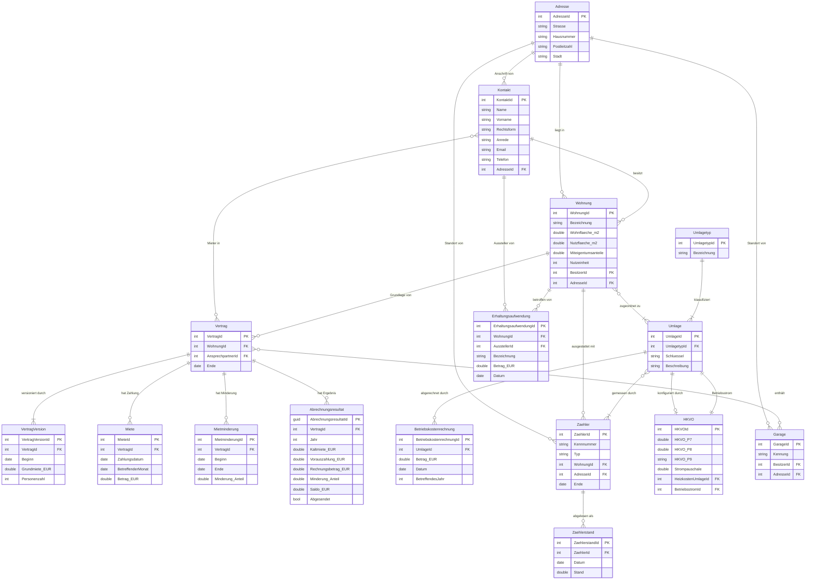

# Datenmodell

Walter verwendet PostgreSQL als Datenbank und Entity Framework Core als ORM. Alle Entitäten befinden sich im Projekt `Deeplex.Saverwalter.Model`.

---

## Entity-Relationship-Diagramm

> **Hinweis zur HKVO:** `HKVO` referenziert zwei `Umlage`-Einträge — einmal die Heizkosten-Umlage (über die die HKVO konfiguriert ist) und einmal eine separate Betriebsstrom-Umlage, aus der der Strompauschalen-Abzug berechnet wird.

---

## Entitäten

### Adresse

Physische Anschrift. Wird von Wohnungen, Garagen, Kontakten und Zählern referenziert.

| Feld           | Typ    | Pflicht | Beschreibung                         |
|----------------|--------|---------|--------------------------------------|
| `AdresseId`    | int    | PK      | Primärschlüssel                      |
| `Strasse`      | string | ja      | Straßenname                          |
| `Hausnummer`   | string | ja      | Hausnummer                           |
| `Postleitzahl` | string | ja      | Postleitzahl                         |
| `Stadt`        | string | ja      | Stadt                                |
| `Notiz`        | string | nein    |                                      |

Berechnetes Feld: `Anschrift` → `"Strasse Hausnummer, PLZ Stadt"`

---

### Kontakt

Repräsentiert eine natürliche oder juristische Person (Vermieter, Mieter, Ansprechpartner, Hausverwaltung).

| Feld           | Typ        | Pflicht | Beschreibung                              |
|----------------|------------|---------|-------------------------------------------|
| `KontaktId`    | int        | PK      | Primärschlüssel                           |
| `Name`         | string     | ja      | Nachname oder Unternehmensname            |
| `Vorname`      | string     | nein    | Vorname (nur natürliche Personen)         |
| `Rechtsform`   | enum       | ja      | Siehe unten                               |
| `Anrede`       | enum       | nein    | `Herr`, `Frau`, `Keine`                  |
| `Telefon`      | string     | nein    |                                           |
| `Mobil`        | string     | nein    |                                           |
| `Fax`          | string     | nein    |                                           |
| `Email`        | string     | nein    |                                           |
| `Adresse`      | Adresse    | nein    | Postanschrift                             |
| `Notiz`        | string     | nein    |                                           |

Berechnetes Feld: `Bezeichnung` → `"Vorname Name"` oder nur `"Name"` falls kein Vorname.

**Rechtsformen:**

| Wert          | Bezeichnung              |
|---------------|--------------------------|
| `natuerlich`  | Natürliche Person        |
| `gmbh`        | GmbH                     |
| `gbr`         | GbR                      |
| `ag`          | AG                       |
| `ev`          | e.V.                     |
| `kg`          | KG                       |
| `ohg`         | OHG                      |
| `ug`          | UG (haftungsbeschränkt)  |
| `stiftung`    | Stiftung                 |
| `verein`      | Verein                   |
| `genossenschaft` | Genossenschaft        |
| `sonstige`    | Sonstige                 |

---

### Wohnung

Die vermietete Wohneinheit. Zentrales Objekt, das Verträge, Zähler, Umlagen und Erhaltungsaufwendungen zusammenführt.

| Feld                    | Typ     | Pflicht | Beschreibung                          |
|-------------------------|---------|---------|---------------------------------------|
| `WohnungId`             | int     | PK      | Primärschlüssel                       |
| `Bezeichnung`           | string  | ja      | Name der Wohnung, z.B. "OG links"    |
| `Wohnflaeche`           | double  | ja      | Wohnfläche in m²                     |
| `Nutzflaeche`           | double  | ja      | Nutzfläche in m²                     |
| `Miteigentumsanteile`   | double  | ja      | MEA-Anteil (für WEG-Abrechnung)      |
| `Nutzeinheit`           | int     | ja      | Anzahl der Nutzeinheiten              |
| `Besitzer`              | Kontakt | nein    | Eigentümer der Wohnung               |
| `Adresse`               | Adresse | nein    | Lage der Wohnung                     |
| `Notiz`                 | string  | nein    |                                       |

Relationen: `Vertraege`, `Zaehler`, `Erhaltungsaufwendungen`, `Umlagen`, `Verwalter`

---

### Vertrag

Ein Mietverhältnis für eine Wohnung. Kann mehrere Versionen (bei Mietänderungen), mehrere Mieter und mehrere Zahlungen haben.

| Feld              | Typ     | Pflicht | Beschreibung                                  |
|-------------------|---------|---------|-----------------------------------------------|
| `VertragId`       | int     | PK      | Primärschlüssel                               |
| `Wohnung`         | Wohnung | ja      | Die zugehörige Wohnung                        |
| `Ansprechpartner` | Kontakt | nein    | Ansprechpartner (Standard: Besitzer)          |
| `Ende`            | DateOnly| nein    | Vertragsende (null = laufend)                 |
| `Notiz`           | string  | nein    |                                               |

Relationen: `Versionen`, `Mieten`, `Mietminderungen`, `Garagen`, `Mieter` (List\<Kontakt\>), `Abrechnungsresultate`

---

### VertragVersion

Eine Version eines Vertrags, gültig ab einem bestimmten Datum. Ermöglicht die Abbildung von Mieterhöhungen oder Personenänderungen ohne einen neuen Vertrag anlegen zu müssen.

| Feld              | Typ      | Pflicht | Beschreibung                              |
|-------------------|----------|---------|-------------------------------------------|
| `VertragVersionId`| int      | PK      | Primärschlüssel                           |
| `Vertrag`         | Vertrag  | ja      | Zugehöriger Vertrag                       |
| `Beginn`          | DateOnly | ja      | Ab wann gilt diese Version                |
| `Grundmiete`      | double   | ja      | Kaltmiete in Euro                         |
| `Personenzahl`    | int      | ja      | Anzahl der im Haushalt lebenden Personen  |
| `Notiz`           | string   | nein    |                                           |

---

### Miete

Eine einzelne Mietzahlung eines Mieters.

| Feld                 | Typ      | Pflicht | Beschreibung                             |
|----------------------|----------|---------|------------------------------------------|
| `MieteId`            | int      | PK      | Primärschlüssel                          |
| `Vertrag`            | Vertrag  | ja      | Zugehöriger Vertrag                      |
| `Zahlungsdatum`      | DateOnly | ja      | Datum der tatsächlichen Zahlung          |
| `BetreffenderMonat`  | DateOnly | ja      | Für welchen Monat die Zahlung gilt       |
| `Betrag`             | double   | ja      | Gezahlter Betrag in Euro (Warm- oder Gesamtmiete) |
| `Notiz`              | string   | nein    |                                          |

---

### Mietminderung

Eine zeitlich begrenzte Minderung der Miete (z.B. wegen Mängeln). Wird bei der Betriebskostenabrechnung anteilig von Kalt- und Nebenkosten abgezogen.

| Feld              | Typ      | Pflicht | Beschreibung                              |
|-------------------|----------|---------|-------------------------------------------|
| `MietminderungId` | int      | PK      | Primärschlüssel                           |
| `Vertrag`         | Vertrag  | ja      | Zugehöriger Vertrag                       |
| `Beginn`          | DateOnly | ja      | Beginn der Minderung                      |
| `Minderung`       | double   | ja      | Minderungsquote als Dezimalzahl (z.B. 0.1 = 10%) |
| `Ende`            | DateOnly | nein    | Ende der Minderung (null = unbegrenzt)    |
| `Notiz`           | string   | nein    |                                           |

---

### Umlagetyp

Die Art einer Betriebskostenposition, z.B. "Heizkosten", "Wasser", "Allgemeinstrom".

| Feld           | Typ    | Pflicht | Beschreibung              |
|----------------|--------|---------|---------------------------|
| `UmlagetypId`  | int    | PK      | Primärschlüssel           |
| `Bezeichnung`  | string | ja      | Name des Kostentyps       |
| `Notiz`        | string | nein    |                           |

---

### Umlage

Verbindet einen Umlagetyp mit einer Gruppe von Wohnungen und legt den Verteilungsschlüssel fest. Eine Umlage kann mehreren Wohnungen zugeordnet sein (n:m).

| Feld           | Typ              | Pflicht | Beschreibung                              |
|----------------|------------------|---------|-------------------------------------------|
| `UmlageId`     | int              | PK      | Primärschlüssel                           |
| `Typ`          | Umlagetyp        | ja      | Art der Betriebskosten                    |
| `Schluessel`   | Umlageschluessel | ja      | Verteilungsschlüssel (siehe unten)        |
| `Beschreibung` | string           | nein    | Optionale Beschreibung                    |
| `HKVO`         | HKVO             | nein    | Heizkostenkonfiguration (nur Heizkosten)  |
| `Notiz`        | string           | nein    |                                           |

Relationen: `Wohnungen` (List\<Wohnung\>), `Betriebskostenrechnungen`, `Zaehler`, `HKVOs`

**Umlageschlüssel:**

| Wert                    | Kürzel   | Beschreibung                                    |
|-------------------------|----------|-------------------------------------------------|
| `NachWohnflaeche`       | n. WF    | Anteil der Wohnfläche an der Gesamtwohnfläche   |
| `NachNutzflaeche`       | n. NF    | Anteil der Nutzfläche an der Gesamtnutzfläche   |
| `NachNutzeinheit`       | n. NE    | Anteil der Nutzeinheiten an den Gesamteinheiten |
| `NachPersonenzahl`      | n. Pers. | Anteil der Personen (gewichtet nach Zeit)        |
| `NachVerbrauch`         | n. Verb. | Anteil des Verbrauchs laut Zählerstand           |
| `NachMiteigentumsanteil`| n. MEA   | Anteil der Miteigentumsanteile                  |

---

### Betriebskostenrechnung

Eine einzelne Rechnung zu einer Umlage für ein bestimmtes Abrechnungsjahr (z.B. die Jahresrechnung des Wasserversorgers).

| Feld                       | Typ      | Pflicht | Beschreibung                          |
|----------------------------|----------|---------|---------------------------------------|
| `BetriebskostenrechnungId` | int      | PK      | Primärschlüssel                       |
| `Umlage`                   | Umlage   | ja      | Zugehörige Umlage                     |
| `Betrag`                   | double   | ja      | Rechnungsbetrag in Euro               |
| `Datum`                    | DateOnly | ja      | Rechnungsdatum                        |
| `BetreffendesJahr`         | int      | ja      | Das Abrechnungsjahr (z.B. 2023)       |
| `Notiz`                    | string   | nein    |                                       |

---

### Zaehler

Ein Verbrauchszähler (Strom, Gas, Warm- oder Kaltwasser). Kann einer Wohnung oder einer Adresse (Allgemeinzähler) zugeordnet sein.

| Feld         | Typ        | Pflicht | Beschreibung                                   |
|--------------|------------|---------|------------------------------------------------|
| `ZaehlerId`  | int        | PK      | Primärschlüssel                                |
| `Kennnummer` | string     | ja      | Eindeutige Zählernummer                        |
| `Typ`        | Zaehlertyp | ja      | Art des Zählers (siehe unten)                  |
| `Wohnung`    | Wohnung    | nein    | Zugehörige Wohnung (null = Allgemeinzähler)    |
| `Adresse`    | Adresse    | nein    | Standort des Zählers                           |
| `Ende`       | DateOnly   | nein    | Außerbetriebnahme                              |
| `Notiz`      | string     | nein    |                                                |

Relationen: `Staende` (List\<Zaehlerstand\>), `Umlagen`

**Zählertypen und Einheiten:**

| Typ           | Einheit |
|---------------|---------|
| `Warmwasser`  | m³      |
| `Kaltwasser`  | m³      |
| `Strom`       | kWh     |
| `Gas`         | kWh     |

---

### Zaehlerstand

Ein abgelesener Stand eines Zählers zu einem bestimmten Datum.

| Feld             | Typ       | Pflicht | Beschreibung                    |
|------------------|-----------|---------|---------------------------------|
| `ZaehlerstandId` | int       | PK      | Primärschlüssel                 |
| `Zaehler`        | Zaehler   | ja      | Zugehöriger Zähler              |
| `Datum`          | DateOnly  | ja      | Ablesedatum                     |
| `Stand`          | double    | ja      | Abgelesener Zählerstand         |
| `Notiz`          | string    | nein    |                                 |

---

### HKVO

Konfiguration gemäß Heizkostenverordnung (HeizkostenV) für eine warme Betriebskostenumlage. Definiert die Parameter für die gesetzlich vorgeschriebene Aufteilung von Heizkosten.

| Feld            | Typ        | Pflicht | Beschreibung                                                           |
|-----------------|------------|---------|------------------------------------------------------------------------|
| `HKVOId`        | int        | PK      | Primärschlüssel                                                        |
| `HKVO_P7`       | double     | ja      | Verbrauchsanteil Heizwärme nach §7 HeizkostenV (z.B. 0.5 = 50%)       |
| `HKVO_P8`       | double     | ja      | Verbrauchsanteil Warmwasser nach §8 HeizkostenV                        |
| `HKVO_P9`       | HKVO_P9A2  | ja      | Berechnungssatz nach §9 Abs. 2 (`Satz_1`, `Satz_2`, `Satz_4`)         |
| `Strompauschale`| double     | ja      | Anteil des Betriebsstroms an den Heizkosten (z.B. 0.05 = 5%)          |
| `Heizkosten`    | Umlage     | ja      | Die Heizkosten-Umlage                                                  |
| `Betriebsstrom` | Umlage     | ja      | Die Betriebsstrom-Umlage (wird anteilig von Heizkosten abgezogen)      |
| `Notiz`         | string     | nein    |                                                                        |

---

### Abrechnungsresultat

Das gespeicherte Ergebnis einer fertig berechneten Betriebskostenabrechnung für einen Vertrag und ein Jahr.

| Feld                    | Typ     | Pflicht | Beschreibung                                              |
|-------------------------|---------|---------|-----------------------------------------------------------|
| `AbrechnungsresultatId` | Guid    | PK      | Primärschlüssel                                           |
| `Vertrag`               | Vertrag | ja      | Zugehöriger Vertrag                                       |
| `Jahr`                  | int     | ja      | Abrechnungsjahr                                           |
| `Kaltmiete`             | double  | ja      | Berechnete Kaltmiete des Jahres                           |
| `Vorauszahlung`         | double  | ja      | Tatsächlich geleistete Gesamtzahlung des Mieters          |
| `Minderung`             | double  | ja      | Gewichtete Mietminderungsquote des Jahres                 |
| `Rechnungsbetrag`       | double  | ja      | Summe aller Betriebskosten (Anteil der Wohnung)           |
| `Saldo`                 | double  | nein    | Positiv = Mieter zahlt nach; Negativ = Vermieter erstattet|
| `Abgesendet`            | bool    | nein    | Ob das Dokument bereits an den Mieter verschickt wurde    |
| `Notiz`                 | string  | nein    |                                                           |

---

### Garage

Ein Garagenstellplatz, der optional einem Vertrag zugeordnet werden kann.

| Feld        | Typ     | Pflicht | Beschreibung              |
|-------------|---------|---------|---------------------------|
| `GarageId`  | int     | PK      | Primärschlüssel           |
| `Kennung`   | string  | ja      | Bezeichnung der Garage    |
| `Besitzer`  | Kontakt | ja      | Eigentümer                |
| `Adresse`   | Adresse | nein    | Standort                  |
| `Notiz`     | string  | nein    |                           |

---

### Erhaltungsaufwendung

Eine Instandhaltungs- oder Reparaturmaßnahme an einer Wohnung (für steuerliche Zwecke und Übersicht).

| Feld                     | Typ     | Pflicht | Beschreibung                     |
|--------------------------|---------|---------|----------------------------------|
| `ErhaltungsaufwendungId` | int     | PK      | Primärschlüssel                  |
| `Wohnung`                | Wohnung | ja      | Betroffene Wohnung               |
| `Aussteller`             | Kontakt | ja      | Rechnungssteller (Handwerker)    |
| `Bezeichnung`            | string  | ja      | Beschreibung der Maßnahme        |
| `Betrag`                 | double  | ja      | Betrag in Euro                   |
| `Datum`                  | DateOnly| ja      | Rechnungsdatum                   |
| `Notiz`                  | string  | nein    |                                  |

---

## Gemeinsame Felder aller Entitäten

Alle Entitäten verfügen über automatisch befüllte Audit-Felder:

| Feld           | Typ      | Beschreibung                         |
|----------------|----------|--------------------------------------|
| `CreatedAt`    | DateTime | Erstellungszeitpunkt (UTC, read-only)|
| `LastModified` | DateTime | Letzter Änderungszeitpunkt (UTC)     |
